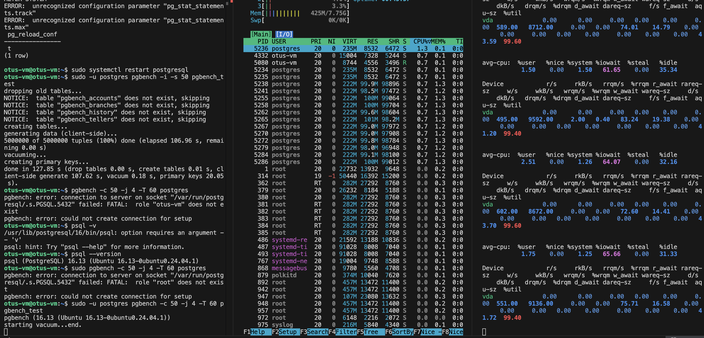
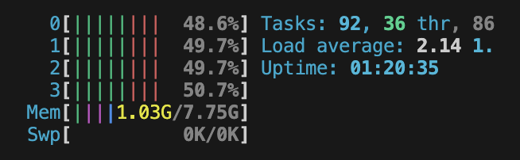
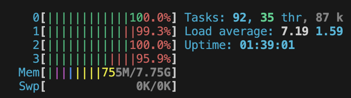

### 1. В Яндекс облаке создан инстанс виртуальной машины с параметрами и внутри установлен PostgreSQL
```
- Имя: otus-vm
- OS: Ubuntu 24.04 LTS
- CPU: 4 (100%)
- RAM: 8 ГБ
- SSD: 20 ГБ
```
```
ssh -i ~/.ssh/yc_key otus-vm@213.165.219.159
```
```
sudo apt update
sudo apt install postgresql
```
### 2. Подготовка системы: настройка Huge Pages и swappiness 
```
sudo vi /etc/systemd/system/disable-thp.service
```
```
[Unit]
Description=Disable Transparent Huge Pages
[Service]
Type=oneshot
ExecStart=/bin/sh -c 'echo never > /sys/kernel/mm/transparent_hugepage/enabled'
ExecStart=/bin/sh -c 'echo never > /sys/kernel/mm/transparent_hugepage/defrag'
[Install]
WantedBy=multi-user.target
```
```
sudo systemctl daemon-reload
sudo systemctl enable disable-thp.service
sudo systemctl start disable-thp.service
sudo systemctl status disable-thp.service
```
```
Created symlink /etc/systemd/system/multi-user.target.wants/disable-thp.service → /etc/systemd/system/disable-thp.service.
○ disable-thp.service - Disable Transparent Huge Pages
     Loaded: loaded (/etc/systemd/system/disable-thp.service; enabled; preset: enabled)
     Active: inactive (dead) since Mon 2026-03-23 12:50:39 UTC; 17ms ago
    Process: 4136 ExecStart=/bin/sh -c echo never > /sys/kernel/mm/transparent_hugepage/enabled>
    Process: 4138 ExecStart=/bin/sh -c echo never > /sys/kernel/mm/transparent_hugepage/defrag >
   Main PID: 4138 (code=exited, status=0/SUCCESS)
        CPU: 5ms
```
#
```
sudo sysctl vm.swappiness=5
vm.swappiness = 5
```
#
```
sysctl -w vm.nr_hugepages=2316
```
```
sudo nano /etc/postgresql/16/main/postgresql.conf
```
```
shared_buffers = 128MB
huge_pages = try
```
### 3. Тестирование производительности с помощью pgbench и мониторинга htop, iostat
```
sudo -u postgres createdb pgbench_test
```
```
sudo -u postgres psql -d pgbench_test << EOF
CREATE EXTENSION IF NOT EXISTS pg_stat_statements;
ALTER SYSTEM SET shared_preload_libraries = 'pg_stat_statements';
ALTER SYSTEM SET pg_stat_statements.track = 'all';
ALTER SYSTEM SET pg_stat_statements.max = 10000;
SELECT pg_reload_conf();
EOF
```
```
 pg_reload_conf 
----------------
 t
(1 row)
```
#
```
sudo -u postgres pgbench -i -s 50 pgbench_test
```
```
dropping old tables...
NOTICE:  table "pgbench_accounts" does not exist, skipping
NOTICE:  table "pgbench_branches" does not exist, skipping
NOTICE:  table "pgbench_history" does not exist, skipping
NOTICE:  table "pgbench_tellers" does not exist, skipping
creating tables...
generating data (client-side)...
5000000 of 5000000 tuples (100%) done (elapsed 106.96 s, remaining 0.00 s)
vacuuming...
creating primary keys...
done in 127.85 s (drop tables 0.00 s, create tables 0.01 s, client-side generate 107.62 s, vacuum 0.18 s, primary keys 20.05 s).
```
#
```
sudo -u postgres pgbench -c 50 -j 4 -T 60 pgbench_test
```
```
pgbench (16.13 (Ubuntu 16.13-0ubuntu0.24.04.1))
starting vacuum...end.
transaction type: <builtin: TPC-B (sort of)>
scaling factor: 50
query mode: simple
number of clients: 50
number of threads: 4
maximum number of tries: 1
duration: 60 s
number of transactions actually processed: 57987
number of failed transactions: 0 (0.000%)
latency average = 52.332 ms
initial connection time = 45.607 ms
tps = 955.434226 (without initial connection time)
```

### 4. Настройка кластера PostgreSQL на оптимальную производительность
```
sudo nano /etc/postgresql/16/main/postgresql.conf
```
```
shared_buffers = 2GB
effective_cache_size = 5GB
temp_buffers = 256MB
work_mem = 128MB
maintenance_work_mem = 1GB

fsync = off
synchronous_commit = off

checkpoint_completion_target = 0.9
effective_io_concurrency = 200
random_page_cost = 1.1

default_statistics_target = 500
join_collapse_limit = 20

maintenance_work_mem = 1GB
autovacuum = on
```
#
```
sudo -u postgres pgbench -c 50 -j 4 -T 60 pgbench_test
```
```
starting vacuum...end.
transaction type: <builtin: TPC-B (sort of)>
scaling factor: 50
query mode: simple
number of clients: 50
number of threads: 4
maximum number of tries: 1
duration: 60 s
number of transactions actually processed: 80955
number of failed transactions: 0 (0.000%)
latency average = 37.076 ms
initial connection time = 47.010 ms
tps = 1348.583260 (without initial connection time)
```

### 4. Настройка кластера PostgreSQL на максимальную производительность
```
sudo nano /etc/postgresql/16/main/postgresql.conf
```
```
wal_level = minimal
max_wal_senders = 0  

wal_buffers = 64MB
checkpoint_timeout = 30min
max_wal_size = 10GB

max_worker_processes = 16
max_parallel_workers = 16
max_parallel_workers_per_gather = 4
```
#
```
sudo -u postgres pgbench -c 50 -j 4 -T 60 pgbench_test
```
```
pgbench (16.13 (Ubuntu 16.13-0ubuntu0.24.04.1))
starting vacuum...end.
transaction type: <builtin: TPC-B (sort of)>
scaling factor: 50
query mode: simple
number of clients: 50
number of threads: 4
maximum number of tries: 1
duration: 60 s
number of transactions actually processed: 346225
number of failed transactions: 0 (0.000%)
latency average = 8.664 ms
initial connection time = 51.704 ms
tps = 5770.778014 (without initial connection time)
```

### 5. Итоговая таблица результатов настройки кластера
| Показатель | До оптимизации | После оптимизации | MAX оптимизация | 
| ----------- | ----------- | ----------- | ----------- |
| latency average    | 52.332 ms   | 37.076 ms   | 8.664 ms  |
| initial connection time    | 45.607 ms   | 47.010   | 51.704 ms   |
| transactions per second  | 955.434226   | 1348.583260   | 5770.778014   |